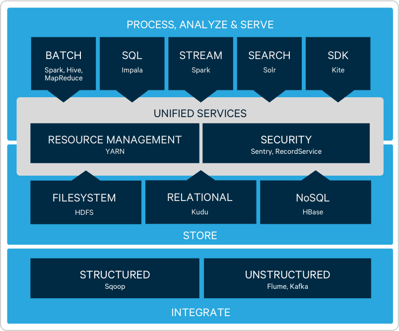

# 2019-02-13

## Cloudera CDH

`Cloudera's Distribution for Hadoop` 의 약자  
[참고](https://kr.cloudera.com/products/open-source/apache-hadoop.html)

- 클라우데라에서 제공하는 하둡 패키지 배포판
- 하둡을 설치하고 다양한 에코시스템을 설치하고 설정하는데 까다로운 과정이 많아 불편했지만 이러한 문제점을 해결하기 위해 클라우데라 라는 회사에서 배포판을 만들었다.
- 간단하게 하둡과 에코시스템을 설치할 수 있다.

